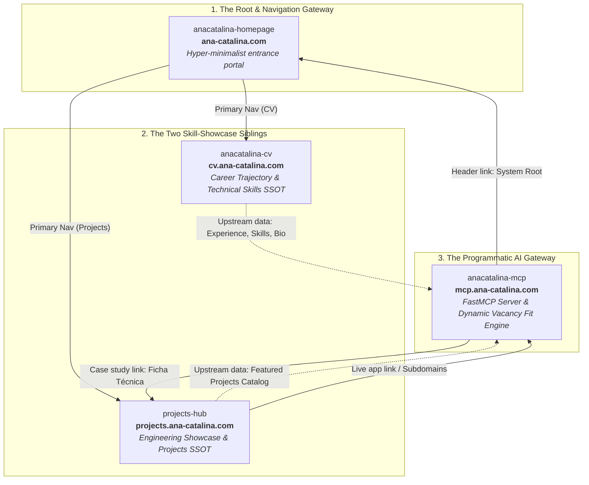

# AGENTS.md — AI Agent Guidelines & Project Manual

> This file provides context to AI assistants (Gemini, Claude, etc.) about this repository.

## Project Description

Professional CV and personal website for **Ana-Catalina Alejandra Villalobos Contardo**, Civil Engineer and Data Scientist / ML Engineer. The site is a static single-page application (SPA) with a modern, responsive design, dark mode, PDF CV download, scroll animations, and bilingual support (Spanish/English).

**Public URL:** https://cv.ana-catalina.com/

## Tech Stack

| Category     | Technology                                      |
| ------------ | ----------------------------------------------- |
| Bundler      | Astro 6                                         |
| Styles       | Tailwind CSS v4 (CSS-first config, custom pastel palette) |
| JavaScript   | ES6+ (vanilla, no frameworks)                   |
| Typography   | Google Fonts — Outfit (headings), Inter (body)   |
| Deployment   | Vercel                                          |
| Node         | v20+                                            |

## Repository Structure

```
anacatalina-cv/
├── public/
│   ├── ACVC_es.pdf          # Downloadable CV in Spanish
│   ├── ACVC_en.pdf          # Downloadable CV in English
│   ├── favicon.ico          # Favicon (ICO fallback)
│   ├── favicon.svg          # Favicon (SVG, primary)
│   ├── og-image.png         # Open Graph banner (1536×1024, ~700KB, primary)
│   ├── og-banner-hd.jpg     # Open Graph banner (1536×1024, legacy fallback)
│   ├── CNAME                # Custom domain: cv.ana-catalina.com
│   └── robots.txt           # Allows all crawlers, points to sitemap
├── src/
│   ├── data/
│   │   └── cv.ts            # Single Source of Truth (SSOT) for all CV content (ES/EN)
│   ├── pages/
│   │   ├── index.astro      # Main Astro component (HTML + Frontmatter)
│   │   └── print/
│   │       └── [lang].astro # Print-optimized template for headless PDF rendering
│   ├── layouts/
│   │   └── Layout.astro     # Shared HTML shell: head/meta, theme init script, Navbar/Footer
│   ├── components/          # Navbar.astro, Footer.astro, PoppyBackground.astro
│   ├── assets/
│   │   └── foto-perfil.jpg  # Profile photo (optimized at build time via astro:assets)
│   ├── main.js              # Core logic: theme, i18n, mobile menu, scroll, animations
│   ├── i18n.js              # ES/EN translations (hydrated dynamically from src/data/cv.ts)
│   └── styles.css           # Tailwind v4 import, `@theme` tokens, custom utilities
├── astro.config.mjs         # Astro config: @tailwindcss/vite + @astrojs/sitemap
├── scripts/generate-pdf.mjs # Renders print pages to PDF via headless Chrome/Edge with 2-page check
├── package.json             # Scripts: dev, build, build:pdf, preview
├── .agents/                 # Workspace agent customizations
│   ├── agents/
│   │   └── cv-reviewer.md   # CV review & synchronization orchestrator
│   └── skills/
│       └── sync-cv/         # Procedures to audit repos and propose CV updates
│           ├── SKILL.md
│           └── scripts/
│               └── scan-activity.mjs # Dynamic repository audit script
└── AGENTS.md                 # This file
```

## Custom Color Palette

Defined in `src/styles.css` under the `@theme` block (Tailwind v4 CSS-first config — there is no `tailwind.config.js`):

| Token          | Hex       | Usage                                    |
| -------------- | --------- | ---------------------------------------- |
| `pastelLilac`  | `#c7b8ea` | Accents, badges, decorative borders      |
| `pastelPink`   | `#f7c6d9` | Hover states, tags, highlights           |
| `pastelBlue`   | `#bcdffb` | Section backgrounds, cards               |
| `pastelMint`   | `#c8f3e0` | Success indicators, fresh accents        |

The base theme uses Tailwind's `slate` scale for grays. Functional accents use `indigo`.

## Dark Mode

- Declared via `@custom-variant dark (&:where(.dark, .dark *));` in `src/styles.css` (Tailwind v4's CSS-first equivalent of `darkMode: 'selector'`), toggled by the `dark` class on `<html>`.
- The toggle adds/removes the `dark` class and persists the preference in `localStorage.theme`.
- Separate icons for desktop and mobile (sun/moon).

## Internationalization (i18n) System

- **File:** `src/i18n.js` exports a `translations` object with keys like `"nav.experiencia"`.
- **HTML:** Elements use `data-i18n="key"` for text and `data-i18n-href="key"` for links.
- **Detection:** Auto-detects browser language; persists in `localStorage.lang`.
- **Toggle:** Separate desktop (`#lang-toggle-desktop`) and mobile (`#lang-toggle-mobile`) buttons.
- When adding new content, translations must be added in BOTH languages (`es` and `en`).

## Interactive Features (main.js)

| Feature              | Description                                                         |
| -------------------- | ------------------------------------------------------------------- |
| Theme Toggle         | Switches light/dark mode with separate desktop/mobile icons         |
| Language Toggle      | Switches between ES/EN updating all `[data-i18n]` elements         |
| Mobile Menu          | Hamburger menu with animated open/close                             |
| Scroll Progress Bar  | Fixed progress bar at the top (`#scroll-progress`)                  |
| Back to Top          | Floating button that appears on scroll > 300px                      |
| Scroll Animations    | IntersectionObserver with `.reveal` → `.active` class               |
| Availability Badge   | Rendered conditionally at build time via the `isAvailableForWork` constant in `src/pages/index.astro`'s frontmatter (currently `false` — the badge markup is omitted from the HTML entirely, not just hidden via JS) |

## Custom Styles (styles.css)

- **`.reveal` / `.reveal.active`** — Scroll-triggered entry animations (opacity + translateY), toggled by the `IntersectionObserver` in `main.js`.
- **`@theme` tokens** — `--color-pastel-*` palette and `--animate-fade-in-up` / `--animate-fade-in` custom animations.
- Custom scrollbar rules for WebKit browsers.
- Note: `.timeline-dot` is used in `index.astro` only as a plain Tailwind-utility-styled element (no corresponding CSS rule in this file); `.glass` is not used anywhere in the codebase.

## Deployment

- **CI/CD:** Vercel.
- **Trigger:** Push to `main`.
- **Process:** Automatic build and deployment via Vercel.
- Base path: `/` (managed by Vercel adapter or default Astro config).

## Development Commands

```bash
npm install      # Install dependencies
npm run dev      # Development server (Astro)
npm run build    # Production build → ./dist/
npm run preview  # Preview production build
```

## Conventions & Rules

### When modifying CV content:
1. Core CV data (experience, education, skills, publications, contact) lives in `src/data/cv.ts` (Single Source of Truth).
2. **Always** maintain translations in both languages (`es` and `en`).
3. **Web vs. PDF Content Granularity (Intentional Asymmetry):** Exact 1:1 text symmetry between the interactive website and the downloadable PDF is not required. Each format serves a distinct editorial purpose:
   - **Interactive Website (`summary.web`, `bullets`, `skills`, `details`):** Designed as an expansive portfolio that provides deeper technical context, architectural narratives, and a comprehensive breakdown of tools and methodologies.
   - **Downloadable PDF (`summary.pdf`, `pdfBullets`, `pdfFormatted`, `pdfDetails`):** Curated as a concise, high-impact executive document synthesized to fit a strict 2-page limit.
   - **Core Invariant (Zero Contradictions):** While the level of detail and phrasing length may differ across formats, both versions must remain strictly aligned in facts, timelines, roles, metrics, and core claims—never introducing conflicting information.
4. Use the `data-i18n="new.key"` attribute in HTML for translatable text if adding new UI elements.
5. Use `data-i18n-href="new.key"` for links that change by language.
6. To regenerate the downloadable PDFs (`ACVC_es.pdf`, `ACVC_en.pdf`), run `npm run build:pdf`. The script automatically uses `dist/print/[lang]/index.html` compiled from `src/data/cv.ts` and enforces a strict 2-page limit.
7. **Strict Authorship Verification (Workplace & Collaborative Repos):** When scanning local repositories to identify new achievements or skills for the CV, always filter commit history (`git log --author=... --no-merges`) strictly by the user's own Git/GitHub identities (resolved dynamically from local Git config, `gh auth status`, or global environment settings). Never attribute teammates' commits or third-party code in shared repositories to the user.

### When modifying styles:
1. Prefer inline Tailwind classes.
2. Only add custom CSS in `src/styles.css` for things Tailwind can't handle.
3. Respect the defined pastel palette.
4. Everything must look good in both light and dark mode (`dark:` variants).

### When adding JS features:
1. All logic goes in `src/main.js` inside the `init()` function.
2. Follow the existing pattern: get element → add listener → handle state.
3. Use descriptive IDs for elements (e.g., `theme-toggle-desktop`, `lang-toggle-mobile`).

### General:
- Never commit `node_modules/` or `dist/`.
- CV PDFs and favicons go in `public/` (served as-is, unoptimized).
- Images meant to be build-time optimized (e.g. the hero photo) go in `src/assets/` and are imported with `astro:assets`' `<Image>` component.
- `index.astro` is in `src/pages/`.

### Layout and Styling Guidelines:
- **Sticky Headers & Anchor Links:** When implementing anchor links (`#id`) that jump to sections below a sticky header, use Tailwind's `scroll-mt-*` (e.g., `scroll-mt-24`) on the target element to prevent the sticky header from hiding the content.
- **Invisible Anchors in CSS Grid:** Do not place empty `<div>` anchor elements as direct children of a `grid` container, as this breaks the grid structure by consuming a full column. Instead, nest the anchor inside a grid item with `relative` positioning, and use absolute positioning for the offset (e.g., `absolute inset-x-0 -top-24`) on the invisible anchor.

---

## 🌐 Portfolio Ecosystem Architecture & Inter-Repository Contract

> **⚠️ Mandatory Cross-Repository Contract Synchronization Invariant:**
> All four repositories (`anacatalina-homepage`, `anacatalina-cv`, `projects-hub`, and `anacatalina-mcp`) form an integrated personal brand and engineering system. If an AI agent or developer modifies, expands, or updates this ecosystem contract, its data flows, architectural boundaries, or shared invariants in this file, **THEY MUST PROACTIVELY SYNCHRONIZE AND UPDATE THIS ENTIRE SECTION ACROSS THE `AGENTS.md` FILES OF ALL FOUR REPOSITORIES IMMEDIATELY**. Never leave any repository with a stale or conflicting understanding of the ecosystem.

### 1. Conceptual Architecture & System Topology

The ecosystem is not a collection of isolated sites; it is a unified, four-node distributed architecture under the apex domain `ana-catalina.com`:



- **`anacatalina-homepage` (`ana-catalina.com`) — The Root Gateway:**
  The minimalist root portal that binds the entire system together. It serves as the primary entrance, welcoming visitors and directing them to the two core showcase dimensions (`CV` and `Projects`), while establishing the baseline design tokens and navigation patterns.
- **`anacatalina-cv` (`cv.ana-catalina.com`) — The Professional Trajectory Sibling:**
  Demonstrates skills through professional employment history, leadership roles (SimpliRoute, Fracttal), academic qualifications (Universidad de Chile), formal publications, and the canonical technical skills taxonomy. Single Source of Truth (SSOT) for biographical and employment data; generates the authoritative 2-page print PDF (`ACVC_es.pdf`, `ACVC_en.pdf`).
- **`projects-hub` (`projects.ana-catalina.com`) — The Engineering & Project Showcase Sibling:**
  Demonstrates skills through working systems, desktop/mobile/web applications, interactive case studies (Bento GUI + Unix terminal console), and dedicated product landing pages (`<slug>.ana-catalina.com`). SSOT for software project statuses, repositories, and technical deliverables.
- **`anacatalina-mcp` (`mcp.ana-catalina.com`) — The Programmatic AI Gateway:**
  Provides AI-native query access to the information maintained across both siblings (`cv` and `projects-hub`) via the official Anthropic Model Context Protocol (FastMCP over Streamable HTTP). Powers dynamic vacancy alignment evaluation (`evaluar_fit_puesto`), keyword search, and an interactive browser showcase (`/demo`).

---

### 2. Single Source of Truth (SSOT) Matrix & Data Flows

| Data Domain | Canonical SSOT Repository | Source Files | Downstream Consumers | Sync Mechanism |
| :--- | :--- | :--- | :--- | :--- |
| **Personal Bio & Identity** | `anacatalina-cv` | `src/data/cv.ts` | `anacatalina-mcp` | Script `scripts/sync_mcp_data.py --sync` |
| **Employment History & Roles** | `anacatalina-cv` | `src/data/cv.ts` | `anacatalina-mcp` | Daily workflow `.github/workflows/upstream-drift.yml` |
| **Skills Taxonomy & Proficiency** | `anacatalina-cv` | `src/pages/index.astro`, `src/data/cv.ts` | `anacatalina-mcp` | Automated audit `python scripts/sync_mcp_data.py --audit` |
| **Print CV Artifacts (PDF)** | `anacatalina-cv` | `public/ACVC_{es,en}.pdf` | Direct downloads, recruiters | `npm run build:pdf` |
| **Software Projects & Repos** | `projects-hub` | `src/content/projects/{es,en}/*.md` | `anacatalina-mcp` | Script `sync_mcp_data.py` (Flagship projects frontmatter) |
| **Cross-Repo Activity Audit** | `projects-hub` | Local sibling scans (`../*`) | `projects-hub` catalog | Script `npm run audit:projects` |
| **Product Subdomains & CNAMEs** | `projects-hub` | `vercel.json` routes | Production users | Vercel DNS + Namecheap CNAMEs |
| **MCP AI Tools & Vacancy Match** | `anacatalina-mcp` | `server.py`, `models/cv.py`, `data/cv_data.json` | Claude, Gemini, Cursor, AI agents | Streamable HTTP `/mcp` |

---

### 3. Shared Ecosystem Invariants & Cross-Project Contracts

Every repository in the portfolio must strictly adhere to the following universal invariants:

1. **Candidate Identity Invariants (Strict Anti-Hallucination):**
   - **Full Legal Name:** `Ana-Catalina Alejandra Villalobos Contardo`
   - **Professional Display Name:** `Ana-Catalina Villalobos Contardo`
   - **First Name:** `Ana-Catalina` (Always hyphenated. NEVER use unhyphenated "Ana Catalina").
   - **GitHub Handle:** `AnaCataVC`
   - **Current Headline:** `Data Scientist & Machine Learning Engineer` (Current SimpliRoute title: `Learning Engineer`, since Aug 2025).
   - **Primary Contact Email:** `anacatalina@outlook.cl` (Contact email is NEVER published on `anacatalina-homepage`; lives exclusively in `cv` and `mcp`).

2. **Unified Navigation Header & Actions Layout:**
   - Container: `max-w-6xl mx-auto px-4 sm:px-6 lg:px-8` with fixed `h-16` (64px) height.
   - Positioning: `absolute top-0 left-0 w-full pointer-events-none` with `pointer-events-auto` on interactive children.
   - Visual Harmony: Clean brand monogram/logo on the left, action buttons / toggles on the right.

3. **Internationalization & Language Synchronization (`localStorage`):**
   - Symmetric bilingual parity across Spanish (`es`) and English (`en`).
   - Every language switcher interaction MUST store the user preference: `localStorage.setItem('lang', 'es' | 'en')`.
   - **SEO-Safe Redirection Invariant:** Never redirect on first page load based on `navigator.language`. Client-side redirections based on language preference must ONLY occur if a previously chosen setting exists in `localStorage` (Note: in this CV repo, `src/main.js` only updates text content in place, keeping the URL stable).

4. **Zero Flags Rule (Strict Documentation & UI Invariant):**
   - NEVER use country flag emojis (`🇺🇸`, `🇬🇧`, `🇪🇸`, `🇲🇽`, etc.) or flag graphics in UI, switches, badges, or documentation.
   - Flags represent sovereign states, not languages; terminal emulators, Windows shells, and XAML render them as broken letters (`[U][S]`) or tofu glyphs (`□□`). Always use ISO codes (`ES`, `EN`) or text labels (`Español`, `English`).

5. **Design Palette & Aesthetics (Pastel-Tech System):**
   - Color palette tokens: Pastel Lilac (`#C7B8EA`), Pastel Pink (`#F7C6D9`), Pastel Blue (`#BCDFFB`), Pastel Mint (`#C8F3E0`), and Dark Canvas (`#1E1A2B` / `#0B0F19`).
   - Typography: `Outfit` for geometric headings, `Inter` for crisp body copy, `JetBrains Mono` for code/specs.
   - Zero Broken Mockups: Every button, toggle, link, and interactive widget must be 100% operational in production.

---

### 4. This Repository's Role in the Ecosystem (`anacatalina-cv`)

- **Component Classification:** The Professional Trajectory Sibling & Biographical SSOT (`cv.ana-catalina.com`).
- **Provided Interfaces & SSOT (Outputs):**
  - Canonical Single Source of Truth for experience, achievements, company metrics, education, and technical skills in `src/data/cv.ts`.
  - Bilingual i18n dictionaries in `src/i18n.js`.
  - Upstream data provider for `anacatalina-mcp` (which consumes `cv.ts` and `#skills` tags via `scripts/sync_mcp_data.py`).
  - Authoritative 2-page print PDFs (`public/ACVC_es.pdf`, `public/ACVC_en.pdf`) generated via `npm run build:pdf`.
- **Consumed Dependencies (Inputs):**
  - Follows design tokens and aesthetic hierarchy established by `anacatalina-homepage`.
  - References sibling showcase projects hosted on `projects-hub` (`https://projects.ana-catalina.com/`).
- **Inter-Repository Verification & Testing Procedures:**
  - When modifying `src/data/cv.ts` or skill taxonomy, run `npm run build` and `npm run build:pdf` to ensure the strict 2-page PDF limit is respected.
  - Modifying or renaming translation keys in `src/i18n.js` or roles in `src/data/cv.ts` directly impacts downstream synchronization in `anacatalina-mcp`. Run `python scripts/sync_mcp_data.py --audit` in `anacatalina-mcp` to ensure cross-ecosystem alignment.

