<p align="center">
  
</p>

# CV Profesional - Ana-Catalina Villalobos

[English](README.md) | [Español](README.es.md)


---

### 1. Descripción del Proyecto
Este repositorio contiene el código fuente para el sitio web personal y CV profesional de **Ana-Catalina Alejandra Villalobos Contardo**, Ingeniera Civil y Data Scientist / ML Engineer. El sitio web está diseñado con una estética moderna, responsiva, con soporte para modo oscuro, descarga de CV en PDF, animaciones al hacer scroll y traducción al inglés.

### 2. Tecnologías Utilizadas
- **Core:** HTML5, CSS3, JavaScript (ES6+), TypeScript
- **Framework & Configuración:** [Astro](https://astro.build/)
- **Estilos:** [Tailwind CSS v4](https://tailwindcss.com/) (con paleta personalizada en tonos pastel)
- **Deployment:** Vercel

### 3. ¿Cómo actualizar el CV? (Fuente Única de Verdad)
Toda la información del CV vive centralizada en un único archivo fuertemente tipado en TypeScript:
1. Edita el contenido en `src/data/cv.ts` (mantiene textos en español e inglés).
2. Ejecuta el comando de compilación y generación de PDFs:
   ```bash
   npm run build:pdf
   ```
   *Este comando compila la web y regenera automáticamente ambos PDFs (`ACVC_es.pdf` y `ACVC_en.pdf`), verificando que se mantenga el límite estricto de 2 páginas y la compatibilidad ATS.*

### 4. Comandos de Desarrollo
```bash
npm install       # Instalar dependencias
npm run dev       # Iniciar servidor de desarrollo local
npm run build     # Verificación de tipos + build de producción → ./dist/
npm run preview   # Previsualizar build de producción en local
npm run build:pdf # Generar y verificar los PDFs del CV (Windows — requiere Edge o Chrome)
```

### 5. Demo en Vivo
🌐 **CV Público:** [https://cv.ana-catalina.com/](https://cv.ana-catalina.com/)

### 6. Aprendizajes Destacados
Durante la construcción de este proyecto, los principales aprendizajes y desafíos incluyeron:
- **Single Source of Truth (SSOT):** Centralización de datos bilingües con TypeScript para alimentar simultáneamente la web interactiva y las plantillas de impresión PDF sin duplicación.
- **Despliegue (Deployment):** Comparar y aprender las diferencias entre el despliegue en GitHub Pages vs Vercel.
- **Diseño Web & ATS:** Creación de documentos PDF que conservan al 100% la estética de marca propia mientras superan filtros ATS gracias a un flujo lineal y capa de texto vectorial nativa.
- **UX/UI:** Optimización de la experiencia de usuario (UX) e interfaz de usuario (UI), incluyendo animaciones suaves y soporte para modo oscuro.
- **Maquetación Avanzada:** Resolución de conflictos de scroll con headers sticky y estructuración de layouts complejos utilizando CSS Grid y Tailwind CSS.

> 💡 **¿Te gusta este diseño?** He creado un template básico de este CV para que puedas usarlo y personalizarlo. Puedes encontrarlo aquí: [AnaCataVC/my-cv](https://github.com/AnaCataVC/my-cv/)

---


